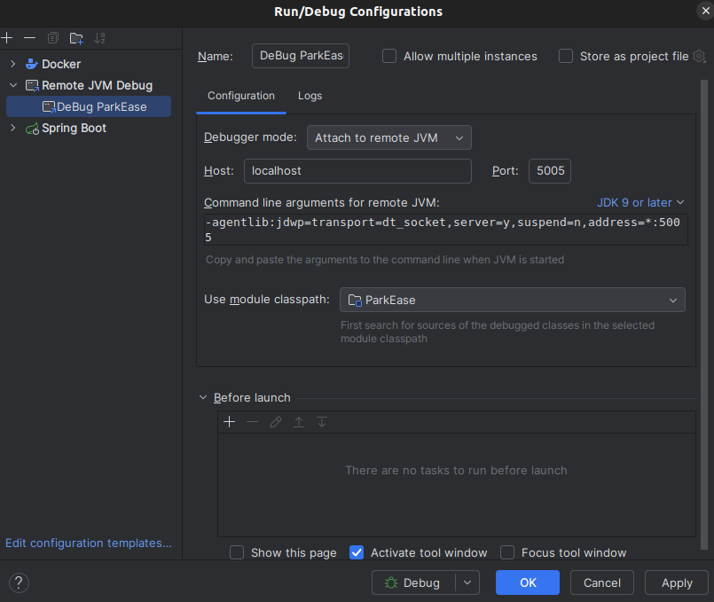

# Sistema de Parquímetro

## Descrição do Projeto

Este projeto apresenta o novo sistema de parquímetro desenvolvido para atender às necessidades de uma cidade turística com uma população de 300.000 habitantes. Durante a alta temporada, a cidade recebe em média 250.000 visitantes adicionais, resultando em um aumento significativo no número de veículos. O sistema antigo, sendo lento, não escalável e não confiável, está sendo substituído por este novo sistema, que foi projetado para lidar com a crescente demanda de estacionamento na cidade.

### Visão Geral do Sistema

O sistema de parquímetro oferece funcionalidades como:
- Registro de condutores e veículos
- Controle de tempo estacionado
- Opções flexíveis de pagamento
- Emissão de recibos

## Tecnologias Utilizadas

- **Java Spring Boot**: Framework para desenvolvimento do backend.
- **MongoDB**: Utilizado para o core do sistema.
- **PostgreSQL**: Usado para armazenar os recibos ao final de cada processo.
- **Docker**: Ferramenta para criar e gerenciar containers.
- **Docker Compose**: Orquestração de containers.

## Como Rodar o Projeto

### Pré-requisitos

- Docker instalado na máquina.

### Passos para Executar

1. Clone o repositório:
    ```bash
    git clone git@github.com:4adjt-group10/park-ease.git
    cd park-ease
    ```

2. Execute o projeto com Docker Compose:
    ```bash
    docker-compose up
    ```

## Acesso às APIs

Após o projeto estar em execução, você pode acessar a documentação e testar as APIs através do Swagger:
- [Swagger UI](http://localhost:8080/swagger-ui/index.html#/)
```angular2html
  http://localhost:8080/swagger-ui/index.html#/
```

## Configuração Debug no InteliJ

1. No menu superior acesse RUN > Edit configuration;
2. Clique em "Add New Configuration";
3. Selecione a configuração (Remote JVM Debug):
    - 

## Acessos aos Serviços

### Mongo Express

- Acesse: [http://0.0.0.0:8081/db/parkesase/](http://0.0.0.0:8081/db/parkesase/) | [http://127.0.0.1:8081/db/parkesase/](http://127.0.0.1:8081/db/parkesase/)
- Usuário: `admin`
- Senha: `pass`

### PgAdmin

1. Acesse: [http://localhost:5050](http://localhost:5050)
2. Credenciais:
  - Email: `pgadmin4@pgadmin.org`
  - Senha: `admin`
3. Configuração do Servidor:
  - Clique em **Add New Server**
  - **Name**: Nome à sua escolha (Ex: ParkEase)
  - **Connection**:
    - **Host name/address**: `postgres`
    - **Port**: `5050`
    - **Maintenance database**: `mydatabase`
    - **Username**: `myuser`
    - **Password**: `secret`
  - Clique em **Save**

## Configurar local no DataGrip/Dbeaver

#### - **Postgres**
- Clique em **Add New Server**
  - **Name**: Nome à sua escolha (Ex: Postgres-ParkEase)
  - **Connection**:
    - **Host name/address**: `localhost`
    - **Port**: `5432`
    - **Maintenance database**: `mydatabase`
    - **Username**: `myuser`
    - **Password**: `secret`
  - Clique em **Save**

#### - **Mongo**
- Clique em **Add New Server**
  - **Name**: Nome à sua escolha (Ex: Mongo-ParkEase)
  - **Connection**:
    - **Host name/address**: `localhost`
    - **Port**: `27017`
    - **User**: `root`
    - **Password**: `secret`
  - Clique em **Save**

---

# Fluxo de Teste

### 1. Criar preço praticado na rota de admin 
- [http://localhost:8080/swagger-ui/index.html#/administrator-controller/create_1](http://localhost:8080/swagger-ui/index.html#/administrator-controller/create_1)

### 2. Registro de condutor e veiculo: 
obs: pode-se cadastrar o condutor junto do veiculo ou separado. 

#### Cadastro de condutor com veiculo: 
- [http://localhost:8080/swagger-ui/index.html#/driver-controller/createDriver](http://localhost:8080/swagger-ui/index.html#/driver-controller/createDriver)

#### Cadastro apenas de veiculo: 
- [http://localhost:8080/swagger-ui/index.html#/vehicle-controller/create](http://localhost:8080/swagger-ui/index.html#/vehicle-controller/create)

### 3. Iniciando fluxo de estacionamento:

- [http://localhost:8080/swagger-ui/index.html#/parking-meter-controller/parkin](http://localhost:8080/swagger-ui/index.html#/parking-meter-controller/parking)
 - Selecione o tipo de parada (Fixo/Variavel);
 - Selecione o tipo de pagamento (Pix/Cartão);

### 4. Sistema realizara o monitoramento automatico de 10min em 10min 
 - Os avisos de monitoramento são exibidos no terminal da aplicação. 

### 5. Quando o fluxo é encerrado, o sistema gera um recibo com as informações podendo variar de acordo com o tipo de parada selecionado, conforme os seguintes cenários:
- Cenários:
  - Cenário 1: Selecionada saída para tipo de parada fixa, com permanência apenas no tempo estipulado na entrada [http://localhost:8080/swagger-ui/index.html#/parking-meter-controller/leaving](http://localhost:8080/swagger-ui/index.html#/parking-meter-controller/leaving):
    - Passado o id do _'arriving'_ serão apresentadas as seguintes informações:
      - Valor: referente ao cálculo de horas previstas inicialmente * tarifa corrente inicial;
      - Data e horário: De chegada e de saída;
      - Tempo total estacionado: Cálculo de horas entre o momento de entrada e de saída (dentro do intervalo estipulado no momento de entrada);
      - Tarifa corrente: Valor da tarifa corrente no momento de entrada;
      - Valor total pago: Cálculo de horas X tarifa corrente;
      - Os campos de valor extra e tarifa extra deverão estar **zerados**, já que só foi utilizado o valor estipulado inicialmente;
      - Nome do motorista;
      - Placa do veículo.

    - Durante a saída, serão gerados o pagamento e o _'invoice'_ com as informações referentes ao pagamento, com informações do motorista e do veículo, o valor, o método de pagamento selecionado e o status do pagamento. Também são apresentadas as datas de criação e processamento.
    - E, por fim, será gerado o voucher com as informações de chegada, saída, tarifas correntes e extra, tempo de permanência, valor pago e id do veículo.

  - Cenário 2: Selecionada saída para tipo de parada fixa, com permanência em tempo superior ao estipulado no momento de entrada [http://localhost:8080/swagger-ui/index.html#/parking-meter-controller/leaving](http://localhost:8080/swagger-ui/index.html#/parking-meter-controller/leaving):
    - Passado o id do _'arriving'_ serão apresentadas as seguintes informações:
      - Valor: referente ao cálculo de horas previstas inicialmente * tarifa corrente inicial;
      - Valor extra: valor referente ao cálculo de horas extras * tarifa extra;
      - Data e horário: De chegada e de saída;
      - Tempo total estacionado: Número total de horas de permanência no estacionamento;
      - Tarifa aplicada: Valor da tarifa corrente no momento de entrada;
      - Tarifa extra: Valor da tarifa no momento de saída (aplicada as horas extras de permanência);
      - Valor total pago: Cálculo de: horas previstas inicialmente * tarifa corrente inicial + (horas extras * tarifa extra);
      - Nome do motorista;
      - Placa do veículo.
    - Durante a saída, serão gerados o pagamento e o _'invoice'_ com as informações referentes ao pagamento, com informações do motorista e do veículo, o valor, o método de pagamento selecionado e o status do pagamento. Também são apresentadas as datas de criação e processamento.
    - E, por fim, será gerado o voucher com as informações de chegada, saída, tarifas correntes e extra, tempo de permanência, valor pago e id do veículo.

  - Cenário 3: Selecionada saída para tipo de parada variável [http://localhost:8080/swagger-ui/index.html#/parking-meter-controller/leavingVariableTime](http://localhost:8080/swagger-ui/index.html#/parking-meter-controller/leavingVariableTime):
    - Passado o id do _'arriving'_ serão apresentadas as seguintes informações:
      - Valor: referente ao cálculo de horas estacionadas * tarifa corrente;
      - Data e horário: De chegada e de saída;
      - Tempo total estacionado: Cálculo de horas entre o momento de entrada e de saída;
      - Tarifa corrente: Valor da tarifa corrente;
      - Valor total pago: Cálculo de horas X tarifa corrente;
      - Os campos de valor extra e tarifa extra deverão estar **zerados**, já que no tipo variável não tem quantidade de horas pré estipulada;
      - Nome do motorista;
      - Placa do veículo.
    - Durante a saída, serão gerados o pagamento e o _'invoice'_ com as informações referentes ao pagamento, com informações do motorista e do veículo, o valor, o método de pagamento selecionado e o status do pagamento. Também são apresentadas as datas de criação e processamento.
    - E, por fim, será gerado o voucher com as informações de chegada, saída, tarifas correntes e extra, tempo de permanência, valor pago e id do veículo.